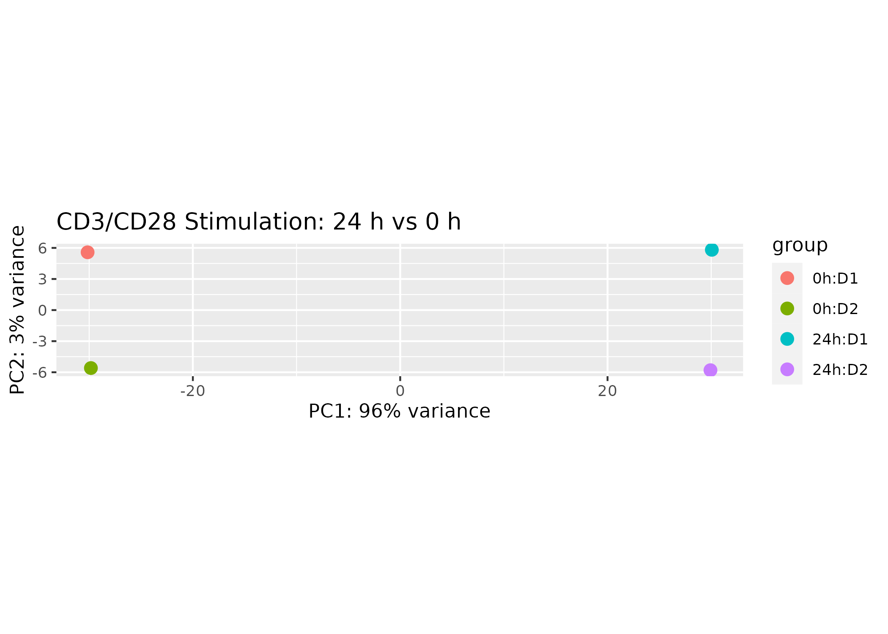
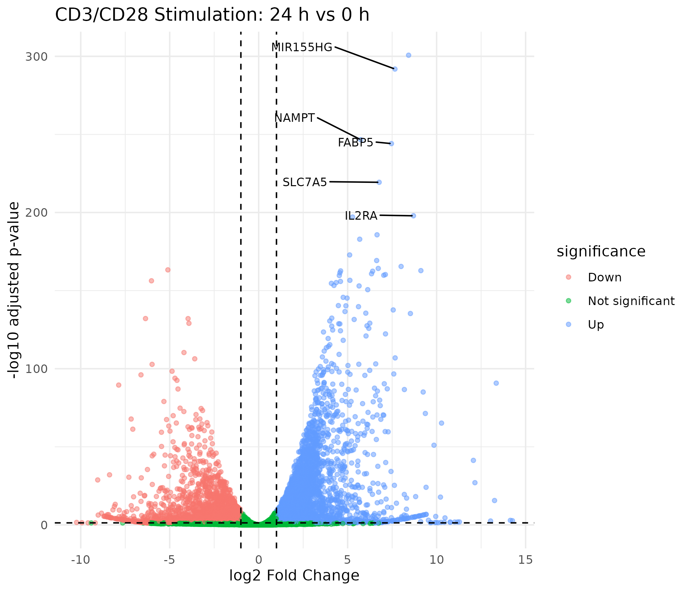
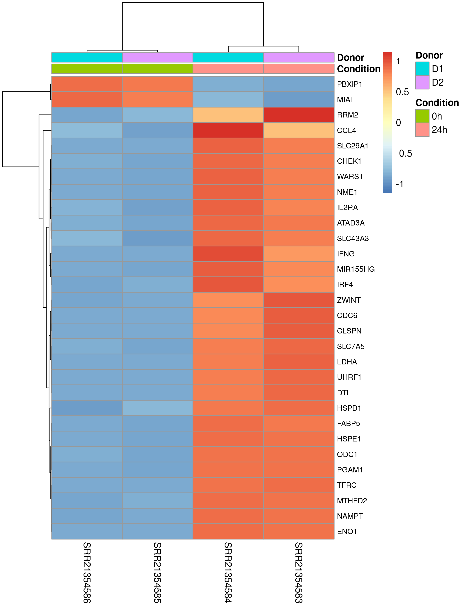
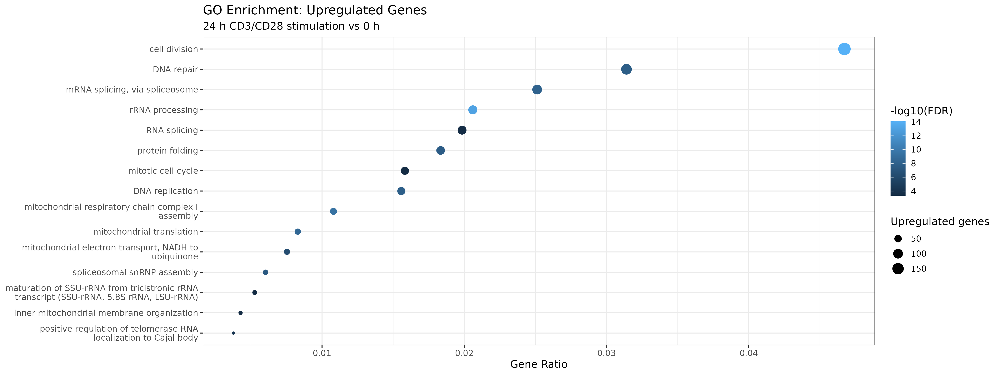
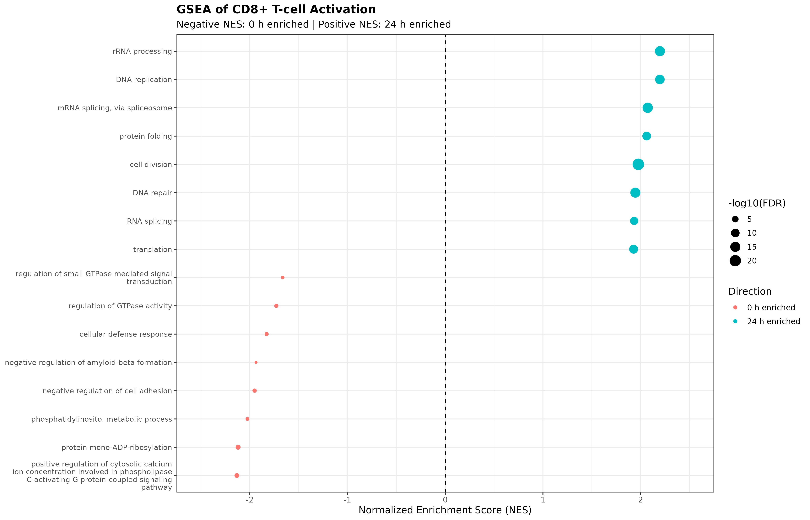

# RNA-seq Analysis of Primary Human CD8+ T-cell Activation

## Overview

This project presents an end-to-end RNA-seq analysis of primary human CD8+ T cells following CD3/CD28 stimulation.

The analysis compares unstimulated CD8+ T cells (0 h) with cells collected 24 hours after CD3/CD28 stimulation using publicly available RNA-seq data from GEO (GSE212353).

The goal was to characterize transcriptional changes associated with early T-cell activation and to demonstrate a reproducible RNA-seq workflow starting from raw sequencing reads.

## Dataset

Public dataset: GSE212353

Samples analyzed:

| Condition | Donor | SRA Run |
|---|---|---|
| 0 h | Donor 1 | SRR21354586 |
| 0 h | Donor 2 | SRR21354585 |
| 24 h CD3/CD28 | Donor 1 | SRR21354584 |
| 24 h CD3/CD28 | Donor 2 | SRR21354583 |

The dataset contains primary human CD8+ T cells sequenced using Illumina technology.

## Analysis Workflow

Raw FASTQ
↓
FastQC / MultiQC
↓
Salmon transcript quantification
↓
tximport
↓
DESeq2 differential expression
↓
PCA / Volcano plot / Heatmap
↓
GO Biological Process enrichment
↓
GSEA

Transcript quantification was performed using Salmon with the GENCODE v50 transcriptome (GRCh38).

Differential expression analysis used a paired donor design:

`~ donor + condition`

Genes were considered differentially expressed using:

- adjusted p-value < 0.05
- |log2 fold change| > 1

## Key Results

CD3/CD28 stimulation produced a strong transcriptional shift in primary CD8+ T cells after 24 hours.

PCA separated unstimulated and stimulated samples primarily along PC1, which explained 96% of the variance.

Using an adjusted p-value threshold of 0.05 and |log2FC| > 1:

- 4,537 genes were upregulated
- 2,662 genes were downregulated

Prominent activation-associated genes included:

- IL2RA
- MIR155HG
- SLC7A5
- FABP5
- NAMPT

GO enrichment and GSEA indicated increased representation of biological processes associated with cell division, DNA replication, RNA processing, protein synthesis, and mitochondrial remodeling following stimulation.

## Validation

To evaluate whether the strong transcriptional separation was specific to the Salmon-based workflow, the analysis was independently repeated using the author-provided STAR gene-count files from GEO.

The author-derived counts reproduced the strong separation between 0 h and 24 h samples and showed similar activation-associated changes in genes including IL2RA, MIR155HG, SLC7A5, FABP5, and NAMPT.

## Limitations

The analysis includes two donors per condition. Therefore, statistical power is limited and the results should be interpreted as an exploratory reanalysis of a strongly stimulated T-cell system.

## Tools

- WSL2 / Ubuntu
- FastQC
- MultiQC
- Salmon
- R
- tximport
- DESeq2
- ggplot2
- pheatmap
- fgsea
- org.Hs.eg.db

## Biological Interpretation

The results are consistent with a transition from a resting CD8+ T-cell state toward an activated and proliferative transcriptional program following CD3/CD28 stimulation.

The strong induction of activation-associated genes together with enrichment of cell-cycle, RNA-processing, translation, and mitochondrial pathways reflects the extensive cellular remodeling required for T-cell activation and proliferation.
## Results

### Principal Component Analysis

PCA showed a strong separation between unstimulated (0 h) and CD3/CD28-stimulated (24 h) CD8+ T cells along PC1.

### Differential Gene Expression

The volcano plot highlights extensive transcriptional changes following 24 h CD3/CD28 stimulation. Activation-associated genes including IL2RA, MIR155HG, SLC7A5, FABP5, and NAMPT were strongly upregulated.

### Expression Pattern of Top Differentially Expressed Genes

The top differentially expressed genes clearly separated unstimulated and stimulated samples, with consistent expression patterns across the two donors.

### GO Biological Process Enrichment

Upregulated genes were enriched for biological processes related to cell division, RNA processing, DNA replication, protein folding, and mitochondrial function.

### Gene Set Enrichment Analysis

GSEA identified coordinated pathway-level changes between resting and stimulated CD8+ T cells. Positive NES values indicate enrichment at 24 h, whereas negative NES values indicate enrichment at 0 h.
